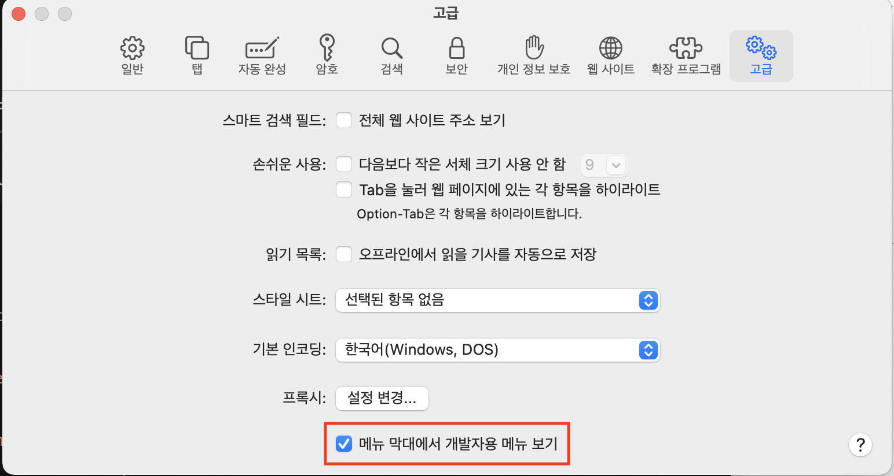
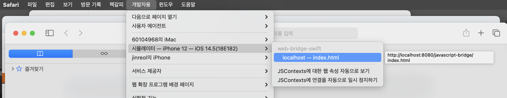
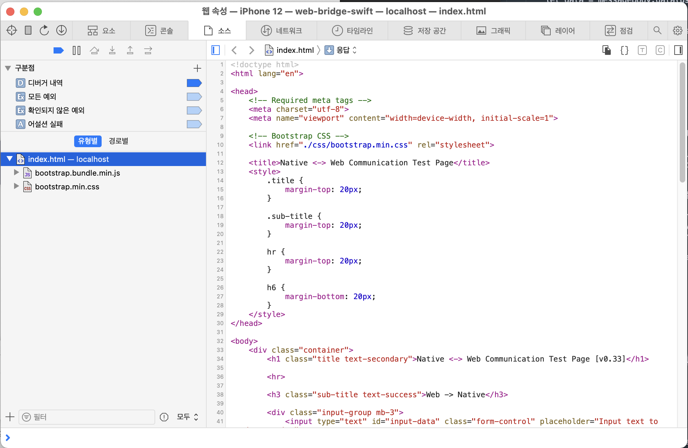

# WKWebView

WKWebView 사용법을 전반적으로 정리한다. 

<br>

### 00. 특징
-----

<br>

> 장점

- 별도 프로세스로 실행   
- 빠른 자바스크립트 엔젠 Nitro 사용
- 자바스크립트 비동기 실행
- 특정 터치 지연 제거
- 서버 인증 문제 지원 
- 사설 인증서 및 오류 인증 지원
- 고효율, 고성능
- IndexdDB, ObjectStore, ArrayBuffer 추가기능 

> 단점

- iOS 9 이상 필요
- 로컬 파일에 ajax 요청할 수 없음 
- 쿠키 수락 설정 불가 
- webview간 쿠기 동기화 안됨
- 고급 캐시 설정 사용 불가
- 앱 종료시 HTML5 LocalStorage가 삭제됨 

<br>

### 01. 웹페이지 로드 
-----

<br>

```swift
let homepageURL = "https://jinreol.github.io/javascript-bridge/index.html"

    private lazy var webView: WKWebView = {
        let configuration = WKWebViewConfiguration()
        
        webView = WKWebView(frame: .zero, configuration: configuration)
        
        let url = URL(string: homepageURL)!
        let request = URLRequest(url: url)
        webView.load(request) // 웹페이지 로드
        
        return webView
    }()
```

<br>

### 02. 자바스트립트 통신: Web -> Native
-----

<br>

1. [Swift] interface 이름 지정
 
2. [Swift] WKUserContentController에 interface를 추가한 뒤. 이를 WKWebViewConfiguration의 userContentController에 적용한다. 

3. [Swift] 설정한 WKWebViewConfiguration을 적용하여 webView 변수 초기화 

```swift
    let exampleInterface = "exampleInteface" // 1. interface 이즘 지정 

    private lazy var webView: WKWebView = {
        let userController: WKUserContentController = WKUserContentController()
        userController.add(self, name: exampleInterface) // 2-1. interface 추가 
        
        // Configuration
        let configuration = WKWebViewConfiguration()
        configuration.userContentController = userController // 2-2. 생성한 WKUserContentController를 적용
        
        webView = WKWebView(frame: .zero, configuration: configuration) // 3. 설정한 WKWebViewConfiguration을 적용하여 webView 변수 초기화 
        
        let url = URL(string: homepageURL)!
        let request = URLRequest(url: url)
        webView.load(request)
        
        return webView
    }()
```

4. [Swift] 자바스크립트 브릿지를 통해 들어오는 데이터를 수신하기 위해서 WKScriptMessageHandler의 delegate를 구현한다. 

```swift
// WKScriptMessageHandler: 자바스크립트 수신 처리
// ================================================================
extension ViewController: WKScriptMessageHandler { 
    // WKScriptMessageHander Delegate 함수 구현
    func userContentController(_ userContentController: WKUserContentController, didReceive message: WKScriptMessage) {
        print("message.name:\(message.name)")
        
        // 메시지 수신 처리 
        if message.name == exampleInterface, let messageBody = message.body as? String {
            print("messageBody:\(messageBody)")
            let data = messageBody.data(using: .utf8)
            let decoder = JSONDecoder()

            if let data = data, let myPerson = try? decoder.decode(WebBrideData.self, from: data) {
                print(myPerson.command)
                print(myPerson.data)
                receiveTextLabel.text = myPerson.data
            }
        }
    }
}
```

5. [JavaScript] 데이터 송부 처리 

```javascript
        function callNativeUpdateText() {
            // input 테그에서 입력된 데이터를 가져오기 
            const inputData = document.getElementById("input-data").value
            console.log("callNativeUpdateText() inputData:", inputData)

            if (inputData == "") {
                alert("텍스트를 입력해 주세요.")
                return
            }
            // Native로 데이터를 보내기 
            try {
                // 프로젝트 시작할 때 여러가지 서비스를 통신하기 위해 인터페이스를 구분해서 정의하는 것이 좋다.
                // 예시) loginInterface, memberInterface, mainInterface, gpsInterface, searchInterface
                // 다양한 타입의 데이터 처리를 위해 json 데이터를 String으로 변환하여 통신한다.
                // 예시) {"screenSize": {"width": 1024, "height": 864}}
                window.webkit.messageHandlers.exampleInteface.postMessage(`{"command": "label", "data": "${inputData}"}`)
            } catch (err) {
                alert(err)
            }
        }
```

<br>

### 03. 자바스트립트 통신: Native -> Web
-----

<br>


1. [Javascript] Native에서 호출할 자바스크립트 함수 생성 
```javascript
        function clickNativeButton01() {
            console.log("clickNativeButton01()")
            document.getElementById("native-event-list").innerHTML =
                document.getElementById("native-event-list").innerHTML +
                `
                <div class="alert alert-warning alert-dismissible fade show" role="alert">
                    Click Native Button 1
                    <button type="button" class="btn-close" data-bs-dismiss="alert" aria-label="Close"></button>
                </div>
                `
        }
```

2. [Swift] Native에서 웹에서 구현된 자바스크립트 함수 호출.  
```swift
    /// Button Click Event
    @objc func actionButton01(sender: UIButton!) {
        self.webView.evaluateJavaScript("clickNativeButton01()")
    }
```

<br>

### 04. 웹뷰 디버깅
-----

<br>

iOS 13부터는 Safari로 미지원 (근데 동작 될 때가 있습니다.) <br>
대신 Safari Technology Preview(https://developer.apple.com/safari/technology-preview/)을 사용하면 됩니다.


> 사파리 디버깅 방법

1. 환경설정 > 고급 > 메뉴 막대에서 개발자용 메뉴 보기 



2. 개발자용 > 시뮬래이터 - 이름 > 페이지 선택 



3. 디버깅 화면 표시



> Safari Technology Preview 디버깅 방법

사파리와 동일

<br>

### 05. 자바스크립트 Alert, Confirm 팝업 처리
-----

<br>

자바스크립트에서 Alert, Confirm 팝업은 기본적으로 화면에 표시되지 않는다. 
표시하기 위해서는 WKUIDelegate Delegate를 구현하고 함수 안에서 Native 화면으로 팝업 화면을 구현해줘야 한다.

```swift
    private func setWebViewDelegate() {
        webView.uiDelegate = self
    }
    
// ================================================================
// WKUIDelegate: javascript 팝업 표시
// ================================================================
extension ViewController: WKUIDelegate {
    
    /// javascript alert 함수가 호출될 때 실행된다.
    func webView(_ webView: WKWebView, runJavaScriptAlertPanelWithMessage message: String, initiatedByFrame frame: WKFrameInfo, completionHandler: @escaping () -> Void) {
        print("자바스크립트 alert를 표시합니다.")
        let alertController = UIAlertController(title: "Alert", message: message, preferredStyle: .alert)
        alertController.addAction(UIAlertAction(title: "OK", style: .default, handler: nil))
        present(alertController, animated: true)
        completionHandler()
    }
    
    /// javascript confirm 함수가 호출될 때 실행된다.
    func webView(_ webView: WKWebView, runJavaScriptConfirmPanelWithMessage message: String, initiatedByFrame frame: WKFrameInfo, completionHandler: @escaping (Bool) -> Void) {
        print("자바스크립트 confirm를 표시합니다.")
        let alertController = UIAlertController(title: "Confirm", message: message, preferredStyle: .alert)
        alertController.addAction(UIAlertAction(title: "YES", style: .default, handler: { _ in
            completionHandler(true)
        }))
        alertController.addAction(UIAlertAction(title: "NO", style: .default, handler: { _ in
            completionHandler(false)
        }))
        present(alertController, animated: true)
    }
}
```

<br>

### 06. WebView 상태 정보 수신
-----

<br>

자바스크립트 상태 정보를 받아 처리하기 위해서는 WKNavigationDelegate를 구현해야 한다. 이를 통해서 로딩바 처리, 네트워크 오류 처리, 외부 브라우저 링크 처리 등등 필요에 따리 웹뷰를 커스터마이징 할 수 있다. 

```swift
    private func setWebViewDelegate() {
        webView.navigationDelegate = self
    }

    // ================================================================
// WKNavigationDelegate: 접속, 로딩, 완료의 진행상태를 알려준다.
// ================================================================
extension ViewController: WKNavigationDelegate {
    func webView(_ webView: WKWebView, didCommit navigation: WKNavigation!) {
        print("웹뷰가 웹 컨텐츠를 받기 시작할 때 호출됩니다.");
    }
    
    func webView(_ webView: WKWebView, didStartProvisionalNavigation navigation: WKNavigation!) {
        print("웹 컨텐츠가 웹뷰에서 로드되기 시작할 때 호출됩니다.");
    }
    
    func webView(_ webView: WKWebView, didReceiveServerRedirectForProvisionalNavigation navigation: WKNavigation!) {
        print("웹뷰가 서버 리디렉션을 수신 할 때 호출됩니다.")
    }
    
    
    func webView(_ webView: WKWebView, decidePolicyFor navigationAction: WKNavigationAction, decisionHandler: @escaping (WKNavigationActionPolicy) -> Void) {
        // 사설 인증서로 구성된 서버로 접근이 가능합니다.
        print("탐색 허용 여부를 결정합니다.")
        decisionHandler(.allow)
    }
    
    func webView(_ webView: WKWebView, didReceive challenge: URLAuthenticationChallenge, completionHandler: @escaping (URLSession.AuthChallengeDisposition, URLCredential?) -> Void) {
        // 사설 인증서로 구성된 서버로 접근이 가능합니다.
        print("웹뷰가 인증 요청에 응답해야 할 때 호출됩니다.")
        let cred = URLCredential(trust: challenge.protectionSpace.serverTrust!)
        completionHandler(.useCredential, cred)
    }
    
    func webView(_ webView: WKWebView, didFail navigation: WKNavigation!, withError error: Error) {
        print("탐색 중에 오류가 발생하면 호출됩니다.")
    }
    
    func webView(_ webView: WKWebView, didFailProvisionalNavigation navigation: WKNavigation!, withError error: Error) {
        print("웹보기가 내용을로드하는 동안 오류가 발생하면 호출됩니다.")
    }
    
    func webView(_ webView: WKWebView, didFinish navigation: WKNavigation!) {
        print("탐색이 완료되면 호출됩니다.")
        activityIndicator.stopAnimating()
    }
    
    func webViewWebContentProcessDidTerminate(_ webView: WKWebView) {
        print("웹뷰의 웹 콘텐츠 프로세스가 종료 될 때 호출됩니다.")
    }
    
    //
    //    func webView(_ webView: WKWebView, decidePolicyFor navigationResponse: WKNavigationResponse, decisionHandler: @escaping (WKNavigationResponsePolicy) -> Void) {
    //        print("응답이 알려진 후 탐색을 허용할지 또는 취소 할지를 결정합니다.")
    //    }
    //
    //    func webView(_ webView: WKWebView, decidePolicyFor navigationAction: WKNavigationAction, preferences: WKWebpagePreferences, decisionHandler: @escaping (WKNavigationActionPolicy, WKWebpagePreferences) -> Void) {
    //        print("instance method")
    //    }
}

```
### 07. WebView 쿠키 
-----

<br>

두 개의 WKWebView 사이에 쿠키가 전달 안되는 이슈가 있다고 해서
splash -> first webview -> native -> second webview 구조로 변경해서 테스트 했지만 전달이 잘 된다. 


